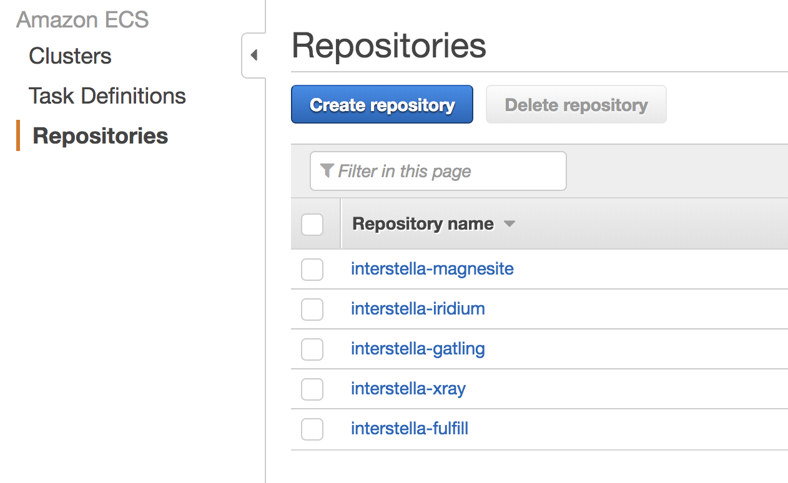
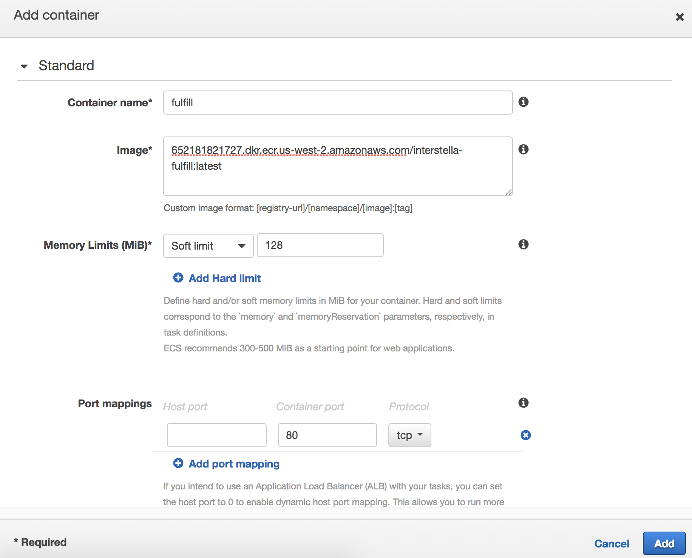
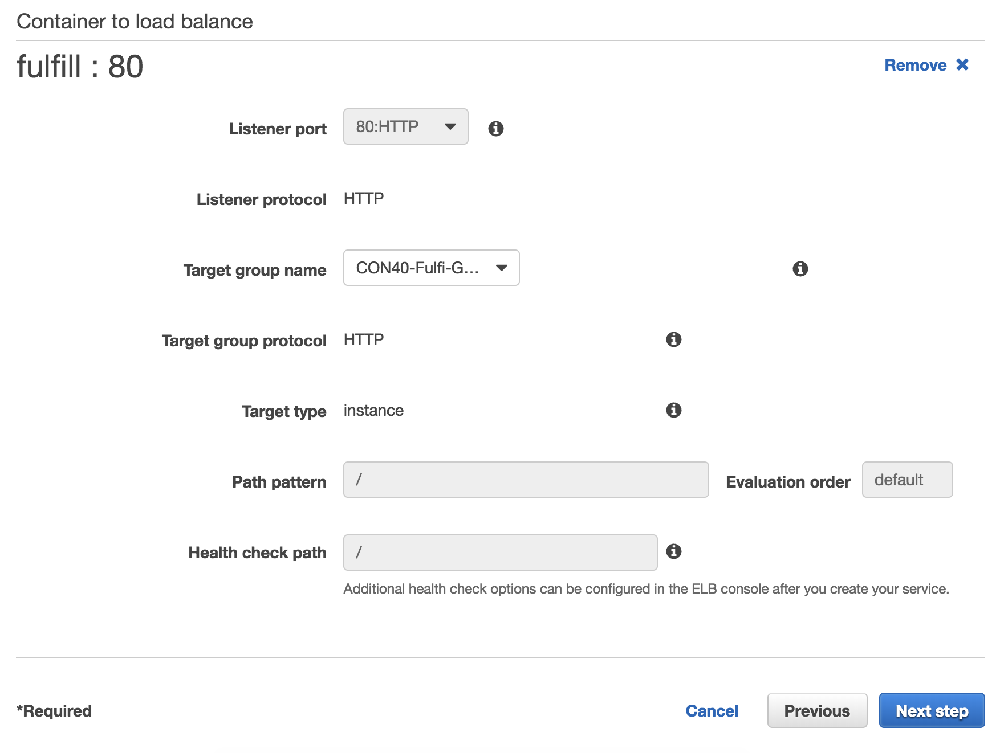
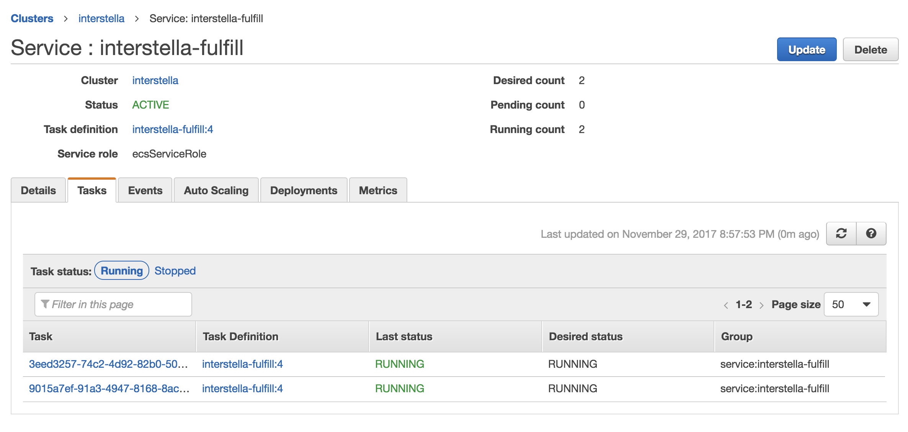
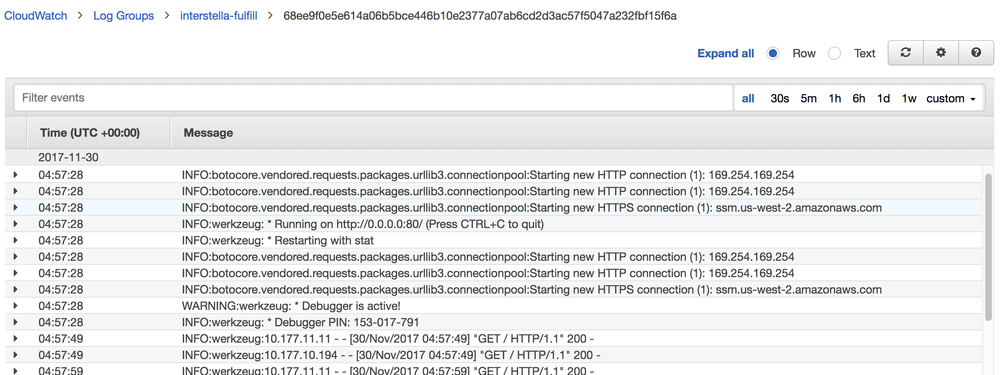
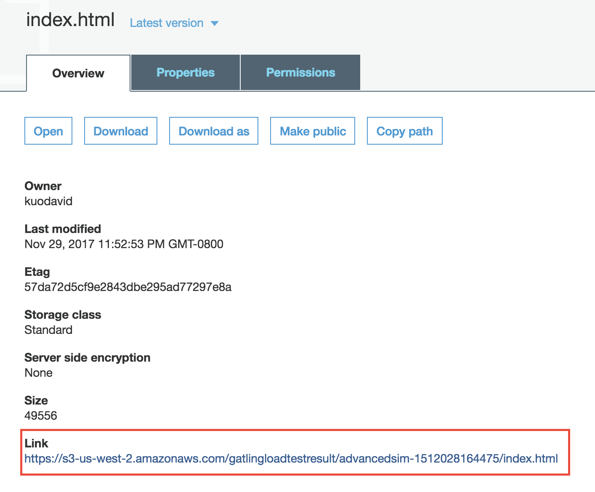
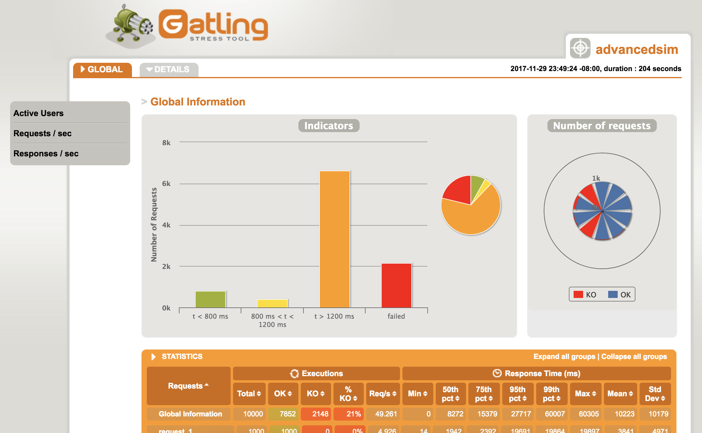
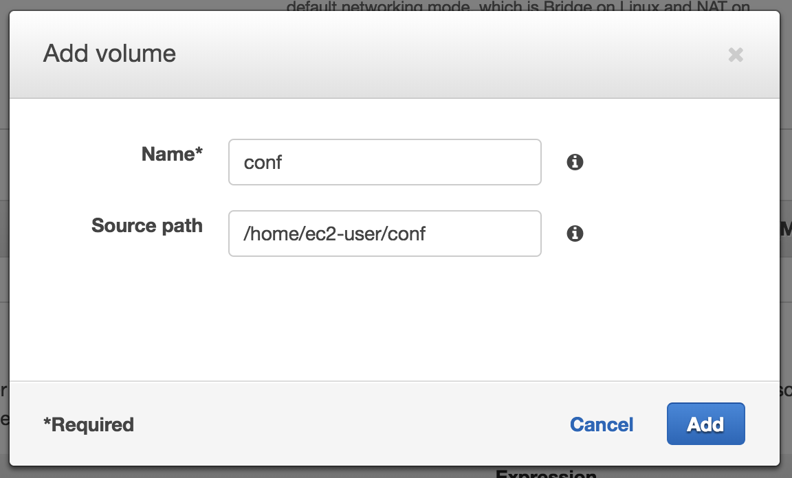

# Interstella 8888: Monolith to Microservices with Amazon ECS

## Overview:
Welcome to the 4th part of the Interstella workshop series!  If you've missed the previous workshops and would like to participate, you can visit www.interstella.trade for links to previous instructions. If you have already walked through the previous labs, we appreciate your continued interest in making Interstella a successful venture and congratulations on making it this far.

To refresh your memory, over the last 3 workhops you have helped Interstella [adopt containers](https://www.trade.interstella/workshop1), modernize its infratructure by converting its legacy [monolithic application into one composed of microservices](http://www.trade.interstella/workshop2), [implemented a CI/CD process](http://www.trade.interstella/workshop3) to help with container lifecycle management and increase deployment agility and flexibility.  In this final workshop, we're going to put your hardwork to test and see if the new architecture is ready for production and enable monitoring and error tracing to reduce your operational overhead.  

This workshop will walk you through deploying a highly available ECS cluster behind an application load balancer, load test it with [Gatling](https://gatling.io/) and perform error tracing and debugging with [AWS X-Ray](https://aws.amazon.com/xray/).

Hang in there, this is the home stretch!

### Requirements:  
* AWS account - if you don't have one, it's easy and free to [create one](https://aws.amazon.com/)
* AWS IAM account with elevated privileges allowing you to interact with CloudFormation, IAM, EC2, ECS, ECR, ELB/ALB, VPC, SNS, CloudWatch
* A workstation or laptop with an ssh client installed, such as [putty](http://www.putty.org/) on Windows; or terminal or iterm on Mac
* Some familiarity with Python, vim/emacs/nano, [Docker](https://www.docker.com/), and AWS; not totally needed, but helpful for your workshop experience.  

### Labs:  
These labs are designed to be completed in sequence, and the full set of instructions are documented below.  Read and follow along to complete the labs.  If you're at a live AWS event, the workshop attendants will give you a high level run down of the labs and be around to answer any questions.  Don't worry if you get stuck, we provide hints along the way.  

* **Workshop Setup:** Setup working environment on AWS  
* **Lab 1:** Build and deploy micro services on ECS
* **Lab 2:** Load test ECS containers using Gatling
* **Lab 2:** Debugging and error tracing with AWS-XRay

### Conventions:  
Throughout this workshop, we provide commands for you to run in the terminal.  These commands will look like this: 

<pre>
$ ssh -i <b><i>PRIVATE_KEY.PEM</i></b> ec2-user@<b><i>EC2_PUBLIC_DNS_NAME</i></b>
</pre>

The command starts after the $.  Text that is ***UPPER_ITALIC_BOLD*** indicates a value that is unique to your environment.  For example, the ***PRIVATE\_KEY.PEM*** refers to the private key of an SSH key pair that you've created, and the ***EC2\_PUBLIC\_DNS\_NAME*** is a value that is specific to an EC2 instance launched in your account.  You can find these unique values either in the CloudFormation outputs or by going to the specific service dashboard in the AWS management console.

Hints are provided along the way and will look like:

HINT

Sweet, you just revealed a hint!

Click on the arrow to show the contents of the hint.  

### Workshop Cleanup:
You will be deploying infrastructure on AWS which will have an associated cost.  Fortunately, this workshop should take no more than 2 hours to complete, so costs will be minimal.  If you're attending an AWS event, credits will be provided.

* * * 

## Let's Begin!  
  
### Workshop Setup:

1\. Log into the AWS Management Console and select an [AWS region](http://docs.aws.amazon.com/AWSEC2/latest/UserGuide/using-regions-availability-zones.html).  The region dropdown is in the upper right hand corner of the console to the left of the Support dropdown menu.  For this workshop, choose either **Ohio** or **Oregon** or **Ireland**.  Workshop administrators will typically indicate which region you should use.

2\. Create an [SSH key pair](http://docs.aws.amazon.com/AWSEC2/latest/UserGuide/ec2-key-pairs.html) that will be used to login to launched EC2 instances.  If you already have an SSH key pair and have the PEM file (or PPK in the case of Windows Putty users), you can skip to the next step.  

Go to the EC2 Dashboard and click on **Key Pairs** in the left menu under Network & Security.  Click **Create Key Pair**, provide a name (e.g. interstella-workshop), and click **Create**.  Download the created .pem file, which is your private SSH key.      

*Mac or Linux Users*:  Change the permissions of the .pem file to be less open using this command:

<pre>$ chmod 400 <b><i>PRIVATE_KEY.PEM</i></b></pre>

*Windows Users*: Convert the .pem file to .ppk format to use with Putty.  Here is a link to instructions for the file conversion - [Connecting to Your Linux Instance from Windows Using PuTTY](http://docs.aws.amazon.com/AWSEC2/latest/UserGuide/putty.html)

3\. Generate a Fulfillment API Key for the logistics software [here](http://www.interstella.trade/getkey.html).  Create a username and password to login to the API Key Management portal; you'll need to access this page again later in the workshop, so don't forget what they are.  Click **GetKey** to generate an API Key.  Note down your username and API Key because we'll be tracking resource fulfillment rates.  The API key will be used later to authorize the logistics software send messages to the order fulfillment API endpoint (see arch diagram in Lab 1).

4\. For your convenience, we provide a [CloudFormation](http://docs.aws.amazon.com/AWSCloudFormation/latest/UserGuide/Welcome.html) template to stand up core workshop infrastructure.

Here is what the workshop environment looks like:

The CloudFormation template will launch the following:
* VPC with public subnets, routes and Internet Gateway
* EC2 Instances with security groups (inbound tcp 22, 80, 5000) and joined to an ECS cluster 
* ECR repositories for the monolith and microservices
* Parameter store to hold values for API Key, fulfillment API endpoint, and SNS Orders topic

*Note: SNS Orders topic, S3 assets, API Gateway and DynamoDB tables are admin components that run in the workshop administrator's account.  If you're at a live AWS event, this will be provided by the workshop facilitators.  We're working on packaging up the admin components in an admin CloudFormation template, so you can run this workshop at your office, home, etc.*

Click on the CloudFormation launch template link below for the region you selected in Step 1.  The link will load the CloudFormation Dashboard and start the stack creation process in the specified region.

Region | Launch Template
------------ | -------------  
**Ohio** (us-east-2) | [Launch Interstella CloudFormation Stack in Ohio](https://console.aws.amazon.com/cloudformation/home?region=us-east-2#/stacks/new?stackName=Interstella-workshop&templateURL=https://s3-us-west-2.amazonaws.com/www.interstella.trade/workshop4/starthere.yaml)  
**Oregon** (us-west-2) | [Launch Interstella CloudFormation Stack in Oregon](https://console.aws.amazon.com/cloudformation/home?region=us-west-2#/stacks/new?stackName=Interstella-workshop&templateURL=https://s3-us-west-2.amazonaws.com/www.interstella.trade/workshop4/starthere.yaml)
**Ireland** (eu-west-1) | [Launch Interstella CloudFormation Stack in Ireland](https://console.aws.amazon.com/cloudformation/home?region=eu-west-1#/stacks/new?stackName=Interstella-workshop&templateURL=https://s3-us-west-2.amazonaws.com/www.interstella.trade/workshop4/starthere.yaml)

You should be on the Select Template page, notice an S3 URL link to the CloudFormation template is already populated.  Click **Next** to continue without modifying any fields on this page.

5\. On the Specify Details step of the Create Stack process, enter values for the following fields:

* **Stack name** - this is just a logical identifier for your CloudFormation stack
* **EnvironmentName** - this name is to used to tag resources created by CloudFormation

IMPORTANT NOTE: for this workshop, please use only lowercase letters because the ECR repository name users this CloudFormation parameter and ECR repository names can only contain lower case letters.

* **KeyPairName** - select the key pair that you created from Step 1
* **InterstellaApiKey** - enter the API key generated from Step 3
* **InterstellaApiEndpoint** - replace this default value if the workshop admins provide you a different fulfillment API endpoint (in the form of a URL) to use
* **InterstellaOrdersTopicArn** - replace this default value, if the workshop admins provide you an SNS orders topic (in the form of an ARN) to use

All other fields can be left as their default values.  

Click **Next** to move on to the Options page.  

6\. No changes or inputs are required on the Options page.  Click **Next** to move on to the Review page.

7\. On the Review page, scroll down to the Capabilities section and click on the checkbox next to *"I acknowledge that AWS CloudFormation might create IAM resources with custom names."*.  If you do not check this box, the stack creation will fail.

Click **Create** to launch the CloudFormation stack. 

### Checkpoint:  
The CloudFormation stack will take a few minutes to lauch.  Periodically check on the stack creation process in the CloudFormation Dashboard.  Your stack should show status **CREATE\_COMPLETE** in roughly 5-10 minutes.  If you select box next to your stack and click on the **Events** tab, you can see what steps it's on.  

If there was an [error](http://docs.aws.amazon.com/AWSCloudFormation/latest/UserGuide/troubleshooting.html#troubleshooting-errors) during the stack creation process, CloudFormation will rollback and terminate.  You can investigate and troubleshoot by looking in the Events tab.  Any errors encountered during stack creation will appear in the event stream as a failure.

* * *

### Lab 1 - Build and deploy micro services on Amazon ECS:   

1\. SSH into one of the launched EC2 instances to get started.

<pre>
$ ssh -i <b><i>PRIVATE_KEY.PEM</i></b> ec2-user@<b><i>EC2_PUBLIC_IP_ADDRESS</i></b>
</pre>

Our dev team already prepared microservices code and Dockerfile for the fulfillment service, iridium and magnesite production, so you just have to build the Docker image as a starting point.  These are similar steps from the last lab, so you should be familiar with the process.  

2\.  Create a working directory for the fulfillment microservice. Download application source, requirements file, and Dockerfile from Interstella's site.  

<pre>
$ cd
$ mkdir -p code/fullfill 
$ cd code/fulfill
$ curl -O https://www.interstella.trade/workshop4/code/fulfill/Dockerfile
$ curl -O https://www.interstella.trade/workshop4/code/fulfill/requirements.txt
$ curl -O https://www.interstella.trade/workshop4/code/fulfill/fulfill.py
</pre>

3\. Build the image using the [Docker build](https://docs.docker.com/engine/reference/commandline/build/) command.  Note the trailing period.

<pre>
$ docker build -t fulfill .
</pre> 

You'll see a bunch of output as Docker builds all the layers to the image.  If there is a problem along the way, the build process will fail and stop.  You may see some warnings during build process; for this workshop, don't worry about it unless the build process stops.  You'll see a success message at the end of the build output like this:

<pre>
Step 15/15 : ENTRYPOINT bin/python fulfill.py
---> Running in 188e00e5c1af
---> 7f51e5d00cee
Removing intermediate container 188e00e5c1af
Successfully built 7f51e5d00cee
</pre>

4\. Now that you have a deployable container, tag and push the image to Amazon EC2 Container Registry (ECR).  You now have version control and persistence, and ECS will reference the image from ECR when deploying the container.    

In the AWS Management Console, navigate to the ECS dashboard and click on **Repositories** in the left menu.  You should see the Docker image repositories created by CloudFormation for the fullfill and resource microservices prefixed by the EnvironmentName you specified in the CloudFormation template.  Here's an example where 'interstella' is used as the EnvironmentName:  

Click on the repository name containing '-fulfill', and note the Repository URI:

*Note: Your repository URI will be unique.  Copy it somewhere, you will need it in the following commands and again later in the lab.*

Tag and push your container image to the repository.

<pre>
$ docker tag fulfill:latest <b><i>ECR_REPOSITORY_URI</i></b>:latest
$ docker push <b><i>ECR_REPOSITORY_URI</i></b>:latest
</pre>

When you issue the push command, Docker pushes the layers up to ECR, and if you refresh the monolith repository page, you'll see an image indicating the latest version.  

*Note: that you did not need to authenticate docker with ECR because the [Amazon ECR Credential Helper](https://github.com/awslabs/amazon-ecr-credential-helper) has been installed and configured for you on the EC2 instance.  This was done as a bootstrap action when launching the EC2 instances.  Review the CloudFormation template and you will see where this is done.  You can read more about the credentials helper in this blog article - https://aws.amazon.com/blogs/compute/authenticating-amazon-ecr-repositories-for-docker-cli-with-credential-helper/*

5\.  **Repeat steps 2 through 4 for Iridium and Magnesite**. 

Here are the commands to download necessary files for Iridium and Magnesite for your convenience. 

<pre>
$ cd
$ mkdir -p code/iridium 
$ cd code/iridium
$ curl -O https://www.interstella.trade/workshop4/code/iridium/Dockerfile
$ curl -O https://www.interstella.trade/workshop4/code/iridium/requirements.txt
$ curl -O https://www.interstella.trade/workshop4/code/iridium/iridium.py
$ cd
$ mkdir -p code/magnesite 
$ cd code/magnesite
$ curl -O https://www.interstella.trade/workshop4/code/magnesite/Dockerfile
$ curl -O https://www.interstella.trade/workshop4/code/magnesite/requirements.txt
$ curl -O https://www.interstella.trade/workshop4/code/magnesite/magnesite.py
</pre>

**Remember you still have to go to each directory to build, tag, and push to respective ECR repositories!**

6\.  Now you're ready to create a an ECS task definition and deploy the fulfill container.

In the AWS Management Console, navigate to the Elastic Container Service dashboard.  Click on **Task Definitions** in the left menu.  Click on **Create New Task Definition**.  

Enter a name for your Task Definition, e.g. interstella-fulfill.  Leave Task Role and Network Mode as defaults. 

Add a container to the task definition.  

Click **Add container**.  Enter values for the following fields:
* **Container name** - this is a logical identifier, not the name of the container image, e.g. fulfill
* **Image** - this is a reference to the container image stored in ECR.  The format should be the same value you used to push the container to ECR - <pre><b><i>ECR_REPOSITORY_URI</i></b>:latest</pre>
* **Memory Limits** - select **Soft limit** from the drop down, and enter **128**.  

*Note: This assigns a soft limit of 128MB of RAM to the container, but since it's a soft limit, it does have the ability to consume more available memory if needed.  A hard limit will kill the container if it exceeds the memory limit.  You can define both for flexible memory allocations.  Resource availability is one of the factors that influences container placement.  You can read more about [ContainerDefinitions](http://docs.aws.amazon.com/AmazonECS/latest/APIReference/API_ContainerDefinition.html) in our documentation*

* **Port mappings** - enter **80** for the container port and leave the host port field empty.  

*Note: ECS offers a dynamic port mapping feature when using the ALB as a load balancer for your container service.  To use this feature you need to leave host port field empty and ALB will automatically assign an ephemeral port to it.  This means you can run multiple copies of a container on a single host.  ECS also takes care of mapping your containers to the ALB target group.*

Your container definition should look something like this so far:

 

Expand the **Advanced container configuration** to set the **Log Configuration** and configure these settings.  

* **Log driver** - select **awslogs** from the drop-down
* **Log options** - enter the name of the CloudWatch log group that you created in the last step, and enter the AWS region of the log group.  You can leave stream prefix blank; this setting is useful when you want to log multiple log sources to a single log group.  We could have done that, but opted for distinct CloudWatch log groups because we are breaking apart the monolith into microservices after all.  

Leave the remaining fields as is and click **Add** to associate this container with the task definition. 

Click **Create** to finish creating the task definition. 

8\. You should be at the task definition view where you can see information pertaining to the task definition you just created.  Let's run the fulfill task as an ECS Service, which maintains a desired task count, i.e. number of containers, as long running processes.  

In the **Actions** dropdown, select **Create Service**.  

Fill in the following fields:

* **Service Name** - this is a logical identifier for your service, e.g. interstella-fulfill
* **Number of tasks** - set to **2**

*Note: There are many options to explore in the Task Placement section of the Run Task action, and while we will not touch on every configuration in this workshop, you can read more about [Scheduling Tasks](http://docs.aws.amazon.com/AmazonECS/latest/developerguide/scheduling_tasks.html) in our documentation.*

Leave the other fields as default and click **Next step**

On the next page, select **Application Load Balancer** for **Load balancer type**.

You'll see a **Load balancer name** drop-down menu appear.  Select the ALB created from the initial CloudFormation template. 

In the **Container to load balance** section, select the **Container name : port** combo from the drop-down menu that corresponds to the task definition you created before. 

Click **Add to load balancer** to add the container.  More fields related to the container will appear.

For the **Listener Port**, select the ALB listener configured durng ALB creation, i.e. "80:HTTP".

For the **Target Group Name**, select the target group created from the initial CloudFormation template. 

Your fields should look similar to this:

Leave the other fields as defaults and click **Next Step**.

Skip auto scaling configuration and click **Next Step**.

*Note: ECS supports Task auto scaling which can automatically increased and describe your desired task count based on dynamic metrics.  We'll skip this for now; you can experiment with this later if you have time.*

Click **Create Service** and click **View Service** to get the status of your service launch.  The *Last Status* will show **RUNNING** once your container has launched.  

9\. Confirm logging to CloudWatch Logs is working. 

Once the monolith service is running, navigate back to the CloudWatch Logs dashboard, and click on your log group.  As your container processes orders, you'll see a log stream appear in the log group reflecting the HTTP POST logs written to stdout you saw earlier.  

Click on the log stream to view log entries.    

10\. **Repeat steps 6 through 10 for Iridium and Magnesite.** 

### Checkpoint:  
At this point you have a working container for the fulfill, iridium and magnesite service with codebase stored in ECR repositories.  You've created a task definition referencing the fulfill, iridium and magnesite container image and deployed it as an ECS service.  Logs are delivered to respective CloudWatch Logs, so you can verify your container is processing orders as expected.  

You've also implemented an ALB as a way to distribute incoming HTTP orders to multiple instances of Interstella 8888's services.  In addition, you're benefiting from ECS/ALB integration for dynamic port mapping to run multiple containers on the same host and path-based routing which allows you to have one ALB endpoint for multiple services.  Now you're ready to start load testing your services!

* * * 

### Lab 2 - Load test ECS containers using Gatling:    

In this lab, you'll be load testing the microservices created in Lab 1 using a load test tool called [Gatling](https://gatling.io) 

1\.  SSH into an EC2 instance launched from cloudformation. It should have a name tag with value equal to your environment + ECS Gatling host.

Go to the EC2 Dashboard in the Management Console and click on **Instances** in the left menu.  Select either an EC2 instances created by the CloudFormation stack, note down the **Public IP** and SSH into the instance.

*Tip: If your instances list is cluttered with other instances, type the **EnvironmentName** you used when running your CloudFormation template into the filter search bar to reveal only those instances.  Look for an instance whose name tag includes the word Gatling*  

*Note: Keep the public IP handy because you will use this instance again for building the microservices images and modifying the monolith code in the next lab.*

<pre>
$ ssh -i <b><i>PRIVATE_KEY.PEM</i></b> ec2-user@<b><i>EC2_PUBLIC_IP_ADDRESS</i></b>
</pre>

If you see something similar to the following message (host IP address and fingerprint will be different, this is just an example) when trying to initiate an SSH connection, this is normal when trying to SSH to a server for the first time.  The SSH client just does not recognize the host and is asking for confirmation.  Just type **yes** and hit **enter** to continue:

<pre>
The authenticity of host '52.15.243.19 (52.15.243.19)' can't be established.
RSA key fingerprint is 02:f9:74:ef:d8:5c:19:b3:27:37:57:4f:da:37:2b:e8.
Are you sure you want to continue connecting (yes/no)? 
</pre>

2\.  Once logged onto the instance, create a working directory for the gatling code, and download the logistics application source, requirements file, and Dockerfile from Interstella's site, edit Gatling scenario files, and set up a special directory structure for Gatling to test it locally. 

Note: the flag for the curl command below is a capital O, not a zero.   

<pre>
$ curl -O https://www.interstella.trade/workshop4/code/gatling/run.sh
$ curl -O https://www.interstella.trade/workshop4/code/gatling/gatling.conf
$ curl -O https://www.interstella.trade/workshop4/code/gatling/Dockerfile
$ curl -O https://www.interstella.trade/workshop4/code/gatling/advancedSim.scala
$ curl -O https://www.interstella.trade/workshop4/code/gatling/basicSim.scala
</pre>

Change the permission of the executable run.sh so that it can be run using Docker container. 

<pre>
$ chmod +x run.sh
</pre>

*If you are not familiar with linux commands, chmod will change the file mode. With this particular command we are adding (+) execution permission (x) so that entities other than the creator have permission to execute this shell script.*

*Note that we have downloaded many more files than just a Dockerfile to build this container.  run.sh is the shell script that the Gatling container will be using for its [CMD](https://docs.docker.com/engine/reference/builder/#cmd) command.  CMD is a Docker command that provides default execution process and parameters for Docker containers. For the rest, gatling.conf is a Gatling configuration file,   advancedSim.scala and basicSim.scala provides test [scenarios](https://gatling.io/docs/2.3/general/simulation_structure/) for Gatling.  Notice that Gatling scenarios are essentially a chain of HTTP requests described in Gatling framework. We recommend taking a look at basicSim.scala and advancedSim.scala to see the test cases we are running.*

*Notice that advancedSim.scala will be simulating 1000 users sending mixed HTTP GET and POST to /iridium/ and /magnesite/ with valid and invalid orders. basicSim.scala is a much simpler test case with only HTTP GET to /iridium/ and /magnesite/, which are all valid GET requests.*

We also need to create the proper directory structure that Gatling is looking for to find its test scenarios. Note that Gatling will look for a configuration file named gatling.conf in ./conf, store results in ./results, and try to find simulation classes under ./user-files/simulations/(package name)/(classname.scala). For example, basicSim.scala will need to be placed in ./user-files/simulations/interstella/basicSim.scala. That is because if you open up basicSim.scala, you'll see that it belongs to the package "interstella" and it is in a class called "basicSim".

<pre>
$ cd
$ mkdir conf
$ mkdir results
$ mkdir -p user-files/simulations/basic
$ mkdir -p user-files/simulations/advanced
$ mv gatling.conf conf
$ mv basicSim.scala user-files/simulations/basic
$ mv advancedSim.scala user-files/simulations/advanced
</pre>

Now we need to open up the scenario files to make sure Gatling is targeting the right end point. Use your favorite editor to open up basicSim.scala and advancedSim.scala. We need to change the baseURL property of the http object found in Gatling Simulation classes. We need to update it to the endpoint we want to test. 

Now let's edit that baseURL and set that URL to the application load balancer that was created for you during the workshop setup.  Before you insert that URL, make sure to paste that URL in browser and try to reach it to make sure that endpoint is valid to serve HTTP GET requests. You should see a welcome to the iridium/magnesite service message with HTTP GET requests. The idea is that we're going to use that base URL to send load tests to /iridium/ and /magnesite/ end points. Make that edit to both basicSim.scala and advancedSim.scala.  

3\.  Create an S3 bucket to store Gatling load test results. Note down the bucket name for next step. 

4\.  Open up run.sh and edit the script to send gatling test results to the bucket you created in step 3. Notice the script you downloaded from interstella.trade website will not work unless you supply an S3 bucket. The default script you downloaded should look like the following. You need to replace (insert S3 bucket name) with an actual S3 bucket you own.

<pre>
#! /bin/sh

# Invoke gatling
gatling.sh -s advancedSim
# Copy results back up to s3 bucket
aws s3 cp results s3://(insert S3 bucket name) --recursive
</pre>

5\.  Build the image using the [Docker build](https://docs.docker.com/engine/reference/commandline/build/) command.  Note the trailing period.

<pre>
$ docker build -t gatling .
</pre> 

6\.  Let's test this Gatling container locally on this EC2 to see if it is working correctly. Notice we'll be using a combination of Docker commands to not only run the container, but we'll be mounting host volumes to container to expose the data on host machine to containers and passing in parameters for the default execution process for this particular container.

<pre>
docker run -it --rm -v /home/ec2-user/conf:/opt/gatling/conf \
-v /home/ec2-user/user-files:/opt/gatling/user-files \
-v /home/ec2-user/results:/opt/gatling/results \
gatling interstella.advancedSim (insert s3 bucket name)
</pre>

*Note that once a simulation has kicked off successfully, you'll see a lots of output from gatling and the process may run for 2-5 minutes.*

7\.  Let's review the results in S3 bucket. First we need to make sure the bucket is public because Gatling has posted html and image files that need to be public for you to be able to view the web page properly. 

Go back to bucket created in step 4, find the folder that represents your test result and make its content public.

8\.  Find index.html file in that result folder. Select that object to go to object view then right click the link to open in new tab or new window. 

Now that you have Gatling running locally on EC2, have you noticed something awkward about the process? What if you have to run the same scenario multiple times? What if you want to run different scenarios? With the current setup, you would have to edit the run.sh script everytime, rebuild container, tag and push container, then run it. This slow process kind of defeat the purpose of using a container doesn't it? 

Don't worry, let's figure out a way to centrally store your test cases and have you pass the name of the scenario you want to run and the bucket you want to send the results to.

9\.  Let's open up the Dockerfile and change the entry point to make the container stand up a shell script runtimen environment as opposed to executing an executable like gatling.sh.

Change this:

<pre>
ENTRYPOINT ["/usr/local/bin/run.sh"]
</pre>

to this:

<pre>
ENTRYPOINT ["sh", "-c"] 
</pre>

10\.  Now let's rebuild, tag, and push that container to the gatling repository but do not build a task definition yet. We think you're pretty familiar with this process now so we're not going to bore you with detailed instructions.

Remember when we ran the container locally we were exposing host machine directory using a docker run -v parameter? That -v parameter allows docker containers to mount host machine directories as if they were containers own volume. How do we do that -v in ECS? 

11\.  Build the Gatling task definition like how you normally would but after you configured the Container Definitions, scroll down a bit to find a Volumes section.

 

Click on "Add volume".

Enter a name, e.g. Conf, then enter the path on the host machine.

Repeat this step 3 times to make a volumes for:

<pre>
/home/ec2-user/conf
/home/ec2-user/results
/home/ec2-user/user-files
</pre>

Now we didn't specifically tell you to output container logs to a Cloudwatch log group. Do you think you should? Do you remember how to do that? 

12\.  Do not create the task definition yet. Return to container configuration by clicking on the container. Find the Storage and Logging section and add mount points. Add mount points to the three volumes you created in last step. It should look like this when you're done. 

Create task definition.

13\.  Now you should be at a place where you can run the newly created task definition. Do not run it yet. Make sure you select the right ECS cluster. We created two ECS cluster for you using cloudformation and you should have a cluster that is named after your cloudformation environment name + "-Gatling". Scroll down a bit further expand Advaned Options to find Container Overrides. We are interested in supplying a shell script in the Command Overrides textbox. 

14\.  Enter the following string into the textbox. 

<pre>
gatling.sh -s interstella.advancedSim && aws s3 cp results s3://(insert S3 bucket name) --recursive
</pre>

Do you see how this is a much easier and flexible process now? 

HINT

We've updated the process to send the name of simulation, that's what the -s parameter stands for, right before we kick off task executions. This means you don't have to modify the shell script that was used in the Dockerfile and have to rebuild, retag and repush to kick off a different simulation with Gatling. 

We've also mounted Gatling container to host machine directories so you have a central location to store all the simulation files. We would recommend you store the simulation cases back in S3 to make sure it is not lost once you terminate the EC2. 

*NOTE:For Command override, type the command override to send. If your container definition does not specify an ENTRYPOINT, the format should be a comma-separated list of non-quoted strings. If your container definition does specify an ENTRYPOINT (such as sh,-c), the format should be an unquoted string, which is surrounded with double quotes and passed as an argument to the ENTRYPOINT command. Please refer to this ECS [documentation](http://docs.aws.amazon.com/AmazonECS/latest/developerguide/ecs_run_task.html) for more details.*

15\. After your task runs successfully. You can review your results in the S3 bucket you created. If your task failed. You know where to look for logs now right?

### Checkpoint:  
In this lab, we have used a load testing tool - Gatling - that lets you simulate interaction with your application on ECS. Gatling not only lets you simulate number of users, their behavior, and request body, it also produces a visual report that allows you to quickly understand how your containers will behave under stress. 

We've now also deployed Gatling to a container so that we can leverage container's agile deployment model to quickly scale up Gatling load tests or quickly switch out test simulations. 

* * *

### Lab 3 - Debugging and error tracing with AWS-XRay: 

In this lab, you will wrap up the journey to microservices by monitoring and error tracing the ECS cluster you've built using [AWS X-Ray](https://aws.amazon.com/xray/).

We've begun to see how useful it is to perform simulations and gather metrics to understand how your containers will behave under stress. Now let's go deeper with an AWS service that will not only show you the relationships between distributed components within your system, but beyond it as well. Onwards with AWS X-Ray!

AWS X-Ray makes it easy for developers to analyze the behavior of their production, distributed applications with end-to-end tracing capabilities.  You can use X-Ray to identify performance bottlenecks, edge case errors, and other hard to detect issues.  X-Ray supports applications, either in development or in production, of any type or size, from simple asynchronous event calls and three-tier web applications to complex distributed applications built using a microservices architecture.  This enables developers to quickly find and address problems in their applications and improve the experience for end users of their applications.

To use X-Ray, we'll have to use X-Ray SDK to intrument our container code to trace incoming HTTP calls and outgoing calls for supported clients.  For Python 3rd party libraries, X-Ray currently support boto3, botocore, requests, sqlite3, mysql-connector-python.  When we say instrumentation, we mean that we're going to edit the python code for iridium, magnesite and fulfill containers to reference X-Ray SDK and middleware for our containers. Notice we're only adding middleware because we're running Python code inside our containers. For other platforms - Java, .NET, and node.js - there are other ways to inject intrumentation. 

After instrumentation, we'll also have to host an X-Ray daemon process near the containers. This is because X-Ray SDK inside your code does not push telemetry data straight to X-Ray service. Instead, X-Ray SDK will push to a nearby X-Ray daemon process to reduce latency. X-Ray daemon will then push that data to X-Ray service.  You have the option to install XRay daemon on a host or in a standalone container. Can you guess which option we're going to go with? At then end, you'll have a dashboard that provides a view of connections between services in your application and aggregated data for each service, including average latency and failure rates 

Let's start by adding intrumentation to iridium and magnesite containers.

1\. First, SSH into the EC2 instance where you built the container for microservices and make the following updates in the requirements.txt files for both iridium and magnesite:

* Add a reference to aws-xray-sdk in requirements.txt
* Add references to AWS X-Ray SDK inside application code

You should still have your SSH session open, but if not, SSH into the same EC2 instance you've been using to build container images throughout the workshop.  Navigate to the iridium code directory and open requirements.txt with your favorite text editor.  

Add the line **aws-xray-sdk==0.94** to the top of the file.

The top of your requirements.txt now should look like this:

<pre>
aws-xray-sdk==0.94
Flask==0.12.2
Jinja2==2.9.6
-- other libraries ...
</pre>

Save and close the file 

Next, open up iridium application code and add references to X-Ray libraries 

<pre>
*other import statements*
from aws_xray_sdk.core import xray_recorder
from aws_xray_sdk.core import patch_all
from aws_xray_sdk.ext.flask.middleware import XRayMiddleware
</pre>

Next, we need to install XRay middleware to our python application to trace incoming requests. Notice that we're not only using Python, we're also using Flask which is a web application framework for Python. XRay middleware will need to talk to an instance of this Flask object and an instance of XRay recorder. XRay recorder is the class from the XRay libraries that will record the application request activities. XRay recorder itself has configuration parameters depending on what you need to do. 

HINT

Notice that the original app object
<pre>
app = Flask(__name__) 
</pre> sits somewhere in the middle of the code. We should move that object to the top of the code file to add and configure XRay middleware as early as possible to start tracing application requests.

<pre>
app = Flask(__name__)
xray_recorder.configure(
    sampling=True,
    context_missing='LOG_ERROR',
    plugins=('EC2Plugin', 'ECSPlugin'),
    service='iridium',
    daemon_address="0.0.0.0:2000"
)
XRayMiddleware(app, xray_recorder)
</pre>

*Note that the key configuration values we should pay attention to are the daemon address, plugins and service. Daemon address tells XRay where the daemon process is located so it can properly push telemetry data. Plugins tell XRay to record information about the service hosting your application. The available plugins include EC2, ECS, and Elastic Beanstalk. Since we're not hosting containers on top of Elastic Beanstalk, we only need to use EC2 and ECS plugin.  Service is the parameter that sets the name XRay uses for [segments](http://docs.aws.amazon.com/xray/latest/devguide/xray-concepts.html). In this lab we're going to use different service names for iridium and magnesite so we can tell the difference between the two microservice*

*Note that we used 0.0.0.0:2000 for that daemon address. Do you think that will work? What should it actually be?*

*To understand other general concepts about XRay, you can refer to [this section](http://docs.aws.amazon.com/xray/latest/devguide/xray-concepts.html) of the XRay documentation.*

Next, to instrument downstream calls, use the X-Ray SDK for Python to patch the libraries that your application uses. We need to insert the following line as early as possible in application code so that any outbound requests will be traced.  

<pre>
patch_all()
</pre>

HINT

So now your code near the top should look like the following:
<pre>
app = Flask(__name__)
xray_recorder.configure(
    sampling=True,
    context_missing='LOG_ERROR',
    plugins=('EC2Plugin', 'ECSPlugin'),
    service='iridium',
    daemon_address="0.0.0.0:2000"
)
XRayMiddleware(app, xray_recorder)
patch_all()
</pre>

Can you guess what outbound calls will be traced by patching the libraries?

HINT

Notice that iridium application code uses boto3 to request for a Amazon EC2 Systems Manager (SSM) parameter. That call will now be trace by X-Ray because you patched the libraries.
<pre>
ssmClient = boto3.client('ssm',region_name=region[:-1])
</pre> 

Next, we have to choose when to creat a segment to start tracing requests. We also have to close the segment when we don't need to trace requests anymore. Add the following line near top of application code.

<pre>
segment = xray_recorder.begin_segment('iridium')
</pre>

HINT

So now your code near the top should look like the following:
<pre>
app = Flask(__name__)
xray_recorder.configure(
    sampling=True,
    context_missing='LOG_ERROR',
    plugins=('EC2Plugin', 'ECSPlugin'),
    service='iridium',
    daemon_address="0.0.0.0:2000"
)
XRayMiddleware(app, xray_recorder)
patch_all()

segment = xray_recorder.begin_segment('iridium')
</pre>

Add the following line right before the end of application code.

<pre>
xray_recorder.end_segment()
</pre>

*Note that X-Ray also allows you to adding metadata and annotation to traces but we are not doing that in this lab. You may want to annotate certain sections of your trace data to easily locate source of error or location in application code.  You can refer to this [documentation](http://docs.aws.amazon.com/xray/latest/devguide/xray-sdk-python-segment.html) to find out more*

HINT

So now the bottom of your iridium application code should look like the this:
<pre>
xray_recorder.end_segment()

if __name__ == '__main__':
    app.run(debug=True, host='0.0.0.0', port=portNum)
</pre>

Next we have to capture traces at function level. Add the following line above every function in application code.

<pre>
@xray_recorder.capture()
</pre>

HINT

So now on top of every function it should look like:
<pre>
@xray_recorder.capture()
def produceResource():
more code...

@xray_recorder.capture()
def fulfill(endpoint, number):
more code...
</pre>

2\. **Repeat step 1 for Magnesite.**

3\. Now we need to host X-Ray daemon process on a container so your microservices can send that Daemon traces and the Daemon will then send those traces to AWS X-Ray. Create a working directory.  Download the Dockerfile from interstella website. Download the X-Ray daemon Linux executable into the same folder as your Dockerfile and build it to create an image.  

Note: the flag for the curl command below is a capital O, not a zero.   

<pre>
$ cd
$ mkdir -p code/xray
$ cd code/xray
$ sudo yum install wget
$ wget https://s3.dualstack.us-east-2.amazonaws.com/aws-xray-assets.us-east-2/xray-daemon/aws-xray-daemon-linux-2.x.zip
$ sudo yum install unzip
$ unzip aws-xray-daemon-linux-2.x.zip
$ curl -O https://www.interstella.trade/workshop4/code/xray/Dockerfile
$ docker build -t xray .
</pre>

5\. Now that you have a deployable container, tag and push the image to Amazon EC2 Container Registry (ECR).  You now have version control and persistence, and ECS will reference the image from ECR when deploying the container.

6\.  Now you're ready to create a an ECS task definition and deploy the xray container.

In the AWS Management Console, navigate to the Elastic Container Service dashboard.  Click on **Task Definitions** in the left menu.  Click on **Create New Task Definition**.  

Enter a name for your Task Definition, e.g. interstella-xray.  Leave Task Role and Network Mode as defaults. 

Add a container to the task definition.  

Click **Add container**.  Enter values for the following fields:
* **Container name** - this is a logical identifier, not the name of the container image, e.g. xray
* **Image** - this is a reference to the container image stored in ECR.  The format should be the same value you used to push the container to ECR - <pre><b><i>ECR_REPOSITORY_URI</i></b>:latest</pre>
* **Memory Limits** - select **Soft limit** from the drop down, and enter **128**.  

* **Port mappings** - enter **2000** for host and container port and select **UDP**. Note that X-Ray daemon listens on UDP protocol. Port number may vary but we cannot use TCP or other protocol.  

Expand the **Advanced container configuration** to set the **Log Configuration** and configure these settings.  

* **Log driver** - select **awslogs** from the drop-down
* **Log options** - we've created a log group named after your environement name plus "-xray". Please refer to cloudformation output or resources pane to find the exact name of log group.

Leave the remaining fields as is and click **Add** to associate this container with the task definition. 

Click **Create** to finish creating the task definition. 

8\. You should be at the task definition view where you can see information pertaining to the task definition you just created.  Let's run the xray task as an ECS Service, which maintains a desired task count, i.e. number of containers, as long running processes.  

In the **Actions** dropdown, select **Create Service**.  

Fill in the following fields:

* **Service Name** - this is a logical identifier for your service, e.g. interstella-xray
* **Number of tasks** - set to **2** because you want a xray daemon running on every container because you tasks can be deployed on any instance in the ECS cluster.

Leave the other fields as default and click **Next step**

Skip adding load balancer and click **Next Step**.

Leave the other fields as defaults and click **Next Step**.

Skip the Auto Scaling configuration by clicking **Next Step**.

Click **Create Service** and click **View Service** to get the status of your service launch.  The *Last Status* will show **RUNNING** once your container has launched.  

9\. Confirm logging to CloudWatch Logs is working. 

Once the xray service is running, navigate back to the CloudWatch Logs dashboard, and click on your log group.  As your container processes orders, you'll see a log stream appear in the log group reflecting the HTTP POST logs written to stdout you saw earlier.  

10\. Go to X-Ray console and see.... nothing? What happened?

11\. Remember we had to set the X-Ray Daemon address inside your application code and we had it set to 0.0.0.0:2000. Do you think your containers are able to access localhost correctly if they are using virtualized networking resources on the host machine? We need to go set the x-ray daemon address to the public IPs of the container instances that containers are sitting on. How do we do that?

Edit both Magnesite.py and Iridium.py to add the following lines:

<pre>
xrayIp = urlopen('http://169.254.169.254/latest/meta-data/public-ipv4').read().decode('utf-8')
</pre>

Update your X-Ray recorder so it looks like the following:

<pre>
app = Flask(__name__)
xray_recorder.configure(
    sampling=True,
    context_missing='LOG_ERROR',
    plugins=('EC2Plugin', 'ECSPlugin'),
    service='iridium',
    daemon_address=xrayIp + ":2000"
)
XRayMiddleware(app, xray_recorder)
patch_all()
</pre>

11\. Open UDP port 2000 on ECS container instances.

Go to EC2 console and find the two EC2s that belong to the ECS cluster and edit security group inbound rule to allow traffic to come into instance through UDP protocol on port 2000.

### Checkpoint: 
In this lab you've learned to use X-Ray with ECS and got a good feel for how to setup instrumentation, standing up an X-Ray daemon, and reviewing the metrics gathered by X-Ray. We know it can be difficult to prepare your distributed application for the unknown but a tool like X-Ray can help you make a more informed decision about how to scale your infrastructure based on the experience you want to deliver. 

* * *

## Finished! Please fill out evaluation cards!

Congratulations on completing the labs or at least giving it a good go.  Thanks for helping Interstella 8888 regain it's glory in the universe!  If you ran out of time, do not worry, we are working on automating the admin side of the workshop, so you will be able to run this lab at your own pace at home, at work, at local meetups, on vacation...ok, maybe that's taking it a bit far.  If you're interested in getting updates, please complete the feedback forms and let us know.  Also, please share any constructive feedback, good or bad, so we can improve the experience for customers like yourselves.

* * * 

## Workshop Cleanup

This is really important because if you leave stuff running in your account, it will continue to generate charges.  Certain things were created by CloudFormation and certain things were created manually throughout the workshop.  Follow the steps below to make sure you clean up properly.  

1. Delete any manually created resources throughout the labs, e.g. ALBs (if you got to the bonus lab).  Certain things like task definitions do not have a cost associated, so you don't have to worry about that.  If you're not sure what has a cost, you can always look it up on our website.  All of our pricing is publicly available, or feel free to ask one of the workshop attendants when you're done.
2. If you got to the bonus lab, you created an ECS service.  To delete that, first update the desired task count to 0, and then delete the ECS service.  
3. Delete any container images stored in ECR, delete CloudWatch logs groups, and delete ALBs and target groups (if you got to the bonus lab)
4. Finally, delete the CloudFormation stack launched at the beginning of the workshop to clean up the rest.  If the stack deletion process encountered errors, look at the Events tab in the CloudFormation dashboard, and you'll see what steps failed.  It might just be a case where you need to clean up a manually created asset that is tied to a resource goverened by CloudFormation.
